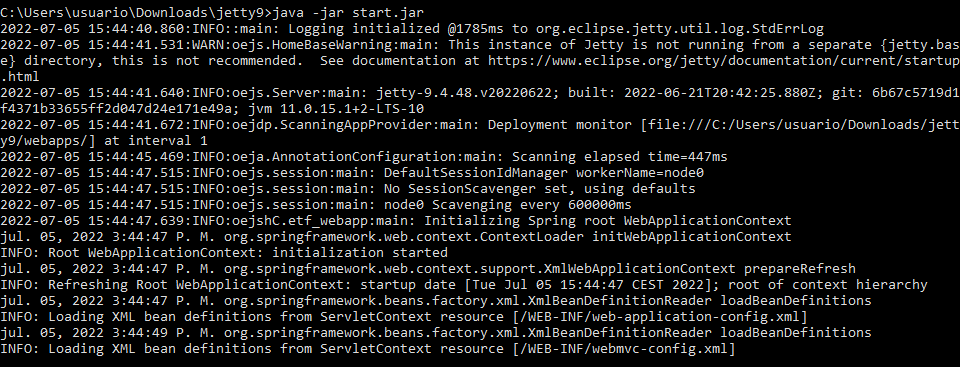
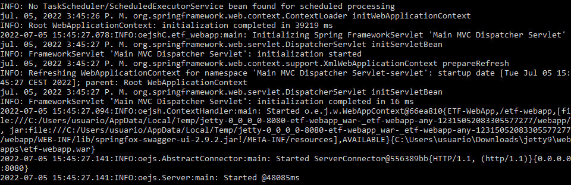

== Installation on Windows

=== Prerequisites on Windows
* Machine with at least 4 GB Ram (8GB are recommended, 16 GB and more if a large set of XML files are tested)
* link:https://jdk.java.net/archive/[OpenJDK 11 is installed]
* link:https://www.eclipse.org/jetty/download.php[Jetty 9 installed]

=== Install ETF web application on Windows

Download these resources provided in the ETF webpage:

* link:https://github.com/etf-validator/etf-webapp/releases/tag/2.1.0[Application etf-webapp.war] 
* link:https://github.com/etf-validator/etf-suitd/releases/tag/2.1.0[Test Driver etf-suitd-legacy-2.1.0-SNAPSHOT.jar]
* link:https://github.com/etf-validator/etf-tetd/releases/tag/1.1.0[Test Driver etf-tetd-1.1.0-SNAPSHOT.jar]
* link:https://github.com/etf-validator/etf-bsxtd/releases/tag/3.0.0[Test Driver etf-bsxtd-legacy-2.1.0-SNAPSHOT.jar]

Each Test Driver can be installed in the link:Admin_manuals/index.html#_etf_data_directory_structure[test driver directory] (fallback **%ALLUSERSPROFILE%\etf\td** ) and will be used by ETF on startup.

Copy the etf-webapp.war file to **JETTY_HOME/webapps** or if you have created a JETTY_BASE, then copy the etf-webapp.war file to **JETTY_BASE/webapps**.

In order to have a proper performance, Java heap size must be set to at least 4 GB RAM (> 8GB are recommended).
Thus, -Xmx parameter needs to be set and assigned to JAVA_OPTIONS updating JAVA_OPTIONS parameter, by setting JAVA_OPTS as environment variable: 
set JAVA_OPTS=%JAVA_OPTS% -Xmx4G
 
Initiate Jetty 9 using **java -jar start.jar** in JETTY_HOME or JETTY_BASE, in case you have one.

.ETF starts to deploy on Windows

.ETF already deployed on Windows

NOTE: To stop the process use *CTRL+C*.

Download <<ets-installation>> and extract archives into the configured project directory (fallback **%ALLUSERSPROFILE%\etf\projects** ). The web application will automatically load the Executable Test Suites after a few seconds.

The web application can be accessed via link:http://localhost:8080/etf-webapp[http://localhost:8080/etf-webapp].

If ETF is accessed not only from one local machine, the **etf.webapp.base.url** property must be changed in the <<etf-configuration-dir>> to your server address (e.g. http://etf-server:8080/etf-webapp).

Check the <<etf-log-file>> file for errors.

