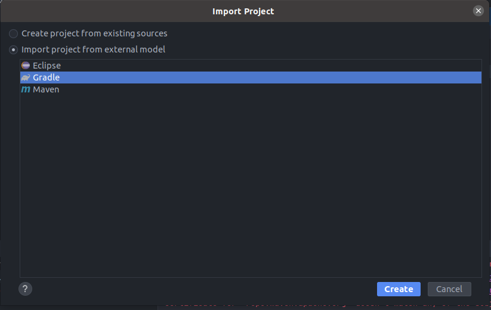

:doctype: book

:stylesdir: ../stylesheets/
:stylesheet: etf.css
:linkcss:

:toc: macro
:toc-title: Table of contents
:toclevels: 2
:toc-position: left
:appendix-caption: Annex

:icons: font
:docinfo: shared

:source-highlighter: pygments
:pygments-style: autumn
:pygments-linenums-mode: inline

include::../General/Logo.adoc[]

:doc-warning-work-in-progress: false
:doc-title: Debugging ETF
:doc-status: approved
:doc-date: 2023-02-01
:doc-description: This manual describes how to remotely debug the components of ETF
:doc-audience: Developers planning to debug the ETF validator themselves
:doc-id: https://docs.etf-validator.net/v2.0/Developer_manuals/Building.html
:doc-lang: EN

include::../General/Document-metadata.adoc[]

== Changelog
[width="100%",options="header",cols="1,2,3"]
|===
|  *Date* | *Editor* | *Comments*
| 2023-02-01 | Guadaltel | document created

|===

<<<

toc::[]

<<<

include::../General/About-short.adoc[]

== Prerequisites

- link:https://jdk.java.net/archive/[OpenJDK 11 is installed]
- IntelliJ instaled
- link:https://git-scm.com/downloads[Git installed]
 

== Cloning the source code

Clone the Source code from the link:https://github.com/etf-validator/etf-webapp[GitHub repository].

[source,bash]
----
git clone -b next https://github.com/etf-validator/etf-webapp.git
----

NOTE: The next branch contains the latests developments.

== Using IntelliJ to run the etf-webapp

First, we have to open Intellij. Once there, we have to follow these instructions to create a project with etf-webapp:

Open the tab file -> select new.. -> open project from existing sources -> select the etf-webapp project 

Once selected it will appear a new window in which you have to select import project from external model and gradle and continue

At this moment you should be seeing the readme. Now we will make the run configuration file. 

image:../images/readme-IJ.png[]

First, open the dropdown menu in which appear by default "Current File", and select "Edit Configurations..."

image:../images/current-file-IJ.png[]

When the new window appear  click in add new and select Smart tomcat once there fill it like in the next example

image:../images/run-configuration-file-IJ.png[]

NOTE: Vm options: -agentlib:jdwp=transport=dt_socket,server=y,suspend=n,address=*:5005

Now we have to select the jdk for our project. For thet we have to follow these instructions:

Open the tab file -> select Project structure -> SDK option will appear as no SDK -> select the SDK version 11

NOTE: If you want to test it you can run it with this configuration and it should work localhost:8080/etf-webapp

== Debugging using IntelliJ

To debug the test drivers, first they have to be cloned from the following links:

- link:https://github.com/etf-validator/etf-bsxtd.git[etf-bsxtd] ETF test driver for running BaseX XQuery based test projects
- link:https://github.com/etf-validator/etf-tetd.git[etf-tetd] ETF test driver for executing Test Suites on a remote OGC TEAM Engine instance
- link:https://github.com/etf-validator/etf-suitd.git[etf-suitd] ETF test driver for running SoapUI based test projects

Test drivers then should be put in a IntelliJ project (It must be a different one than the one running etf-webapp) so we have to follow similar instructions than with etf-webapp:

Open the tab file -> select new.. -> open project from existing sources -> select the testdriver project (Select only one of them)

And once is created we have to create a new run configuration file. This time we have to create one selecting remote jvm debug and filled it like in the followin example:

image:../images/debug-configuration-file-IJ.png[]

NOTE: In Command line arguments for remote JVM, you have to put the same as in vm options of the webapp

Now we have to select the jdk for our project. For thet we have to follow the same instructions as in the etf-webapp module:

Open the tab file -> select Project structure -> SDK option will appear as no SDK -> select the SDK version 11

== Adding the ETS repository

First you have to download the ETS repository from one link:https://github.com/INSPIRE-MIF/helpdesk-validator/releases[release] and extract it.

Then you have to run the etf-webapp once because it will create a folder called ".etf". Inside of it, you will find some folders, and in the projects folder you will have to copy the extracted files from the already extracted ETS repository. 

Now, when you run again the etf-webapp you will find all the ETS to start testing.

== How to use

First, we have to have both projects opened in different windows, run the webapp, debug in the other window and it should work.

NOTE: If u want to debug another test driver or anything contained you just need to add a new module with the contents of the project you want to debug.

***

include::../General/Legal_Privacy.adoc[]
